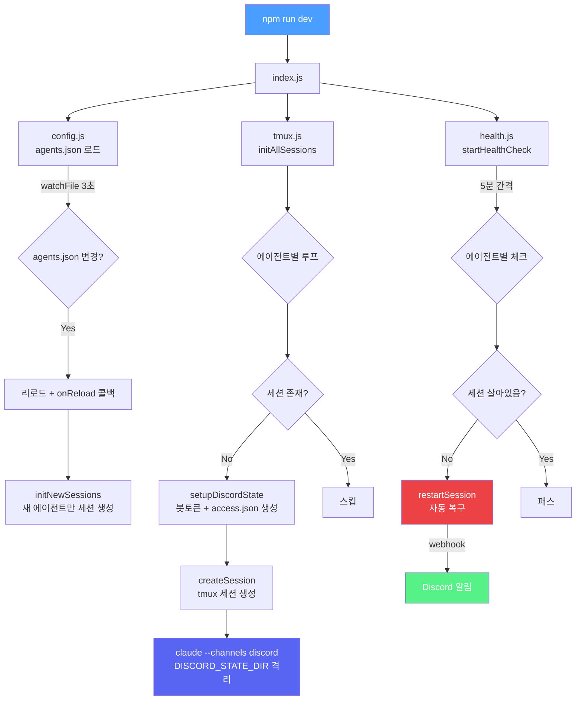

# Oh My Discord Agents

> 하나의 서버에서 여러 Claude Code 에이전트를 Discord 채널로 운영하는 템플릿

채널 하나 = 에이전트 하나. Discord에서 메시지를 보내면 해당 프로젝트의 Claude Code가 응답합니다.

## 구조

```
┌─ Discord Server ─────────────────────┐
│                                      │
│  #project-a      ──→  🤖 봇A         │
│  #project-b      ──→  🤖 봇B         │
│  #project-c      ──→  🤖 봇C         │
│                                      │
└──────────────────────────────────────┘
         │
         ▼
┌─ 서버 (tmux) ────────────────────────┐
│                                      │
│  tmux: project-a                     │
│  └─ claude --channels discord        │
│     └─ DISCORD_STATE_DIR (봇A 격리)   │
│                                      │
│  tmux: project-b                     │
│  └─ claude --channels discord        │
│     └─ DISCORD_STATE_DIR (봇B 격리)   │
│                                      │
│  ...                                 │
└──────────────────────────────────────┘
```

## 실행 구조



## 핵심 원리

Claude Code의 `--channels plugin:discord@claude-plugins-official` 기능으로 Discord 채널과 연결합니다.

`DISCORD_STATE_DIR` 환경변수로 에이전트마다 봇 토큰과 접근 설정을 격리하여, **하나의 서버에서 여러 Discord 봇을 동시에 운영**할 수 있습니다.

## 사전 준비

- Linux 서버 (tmux 필요)
- [Claude Code](https://claude.ai/code) 설치 + `claude login` (OAuth)
- [Bun](https://bun.sh) 설치 (Discord 채널 플러그인 런타임)
- Claude Code 내에서 `/plugin install discord@claude-plugins-official`

## 빠른 시작

### 1. 클론

```bash
git clone https://github.com/738/oh-my-discord-agents.git
cd oh-my-discord-agents
```

### 2. Discord 봇 생성

에이전트 수만큼 봇을 생성합니다. 각 봇마다 [Discord Developer Portal](https://discord.com/developers/applications)에서:

1. **New Application** → 앱 이름 입력
2. **Bot** 탭 → Privileged Gateway Intents **3개 모두 활성화**:
   - Presence Intent
   - Server Members Intent
   - Message Content Intent
3. **Bot** → **Reset Token** → 토큰 복사 (한 번만 표시됨)
4. **OAuth2** → **URL Generator**:
   - Scopes: `bot`
   - Bot Permissions: `Send Messages`, `Read Message History`, `View Channels`
   - 생성된 URL로 접속 → 서버에 봇 추가

### 3. Discord 채널 생성

1. Discord 서버에서 에이전트별 채널 생성 (예: `#project-a`)
2. 채널 우클릭 → **채널 ID 복사**
   - 개발자 모드 필요: 사용자 설정 → 고급 → 개발자 모드 활성화

### 4. agents.json 설정

`agents.example.json`을 복사하여 작성합니다:

```bash
cp agents.example.json agents.json
```

```json
{
  "project-a": {
    "channels": [
      { "id": "디스코드채널ID_1", "requireMention": false },
      { "id": "디스코드채널ID_2", "requireMention": true }
    ],
    "repo": "/path/to/project-a",
    "botToken": "봇토큰",
    "allowFrom": ["디스코드유저ID"],
    "description": "프로젝트 A"
  },
  "project-b": {
    "channels": [
      { "id": "디스코드채널ID", "requireMention": true }
    ],
    "repo": "/path/to/project-b",
    "botToken": "봇토큰",
    "allowFrom": ["디스코드유저ID"],
    "description": "프로젝트 B"
  }
}
```

| 필드 | 설명 |
|------|------|
| `channels` | 채널 설정 배열 |
| `channels[].id` | Discord 채널 ID |
| `channels[].requireMention` | `true`면 해당 채널에서 봇 멘션 시에만 응답 (기본값: `false`) |
| `repo` | 프로젝트 레포 경로 (절대 경로) |
| `botToken` | Discord 봇 토큰 |
| `allowFrom` | 허용할 Discord 유저 ID 목록 |
| `description` | 에이전트 설명 (로그용) |

> **유저 ID 확인:** Discord에서 본인 프로필 우클릭 → 사용자 ID 복사

### 5. 실행

```bash
cp .env.example .env
# LOG_WEBHOOK_URL 설정 (선택 — Discord webhook으로 헬스체크 알림)

npm run dev
```

### 6. 확인

```bash
# 세션 확인
tmux ls

# 에이전트 세션 접속
tmux attach -t project-a
# "Listening for channel messages" 표시되면 성공
# Ctrl+B, D 로 빠져나오기
```

Discord 채널에 메시지를 보내서 응답이 오는지 확인합니다.

## `agents` CLI

세션을 수동 제어하기 위한 CLI입니다. 모델 전환 시 "대화 이어서 재시작"이 핵심.

```bash
# 전역 설치 또는 npx 사용
npx agents <command>
# 또는 npm scripts
npm run list
npm run restart-all
```

### 커맨드 일람

| 커맨드 | 설명 |
|--------|------|
| `agents list` | 모든 에이전트와 세션 상태(🟢/🔴) |
| `agents status <id>` | 특정 에이전트 상세 + 최근 출력 10줄 |
| `agents logs <id> [--lines=N]` | tmux 최근 출력 |
| `agents attach <id>` | tmux attach |
| `agents restart <id>` | 특정 에이전트 **이어서** 재시작 (`claude --continue`) |
| `agents restart-all [--parallel]` | 전체 이어서 재시작 ← **모델 전환용** |
| `agents fresh <id>` | 특정 에이전트 **새 세션**으로 시작 (히스토리 없음) |
| `agents fresh-all [--parallel]` | 전체 새 세션 |
| `agents kill <id>` / `kill-all` | 세션만 종료 |
| `agents init` | 미존재 세션만 생성 (`npm run dev`의 초기화 부분) |

### 새 Claude 모델 출시 시 전환 가이드

예: Opus 4.7 같은 새 모델이 나와서 모든 에이전트를 해당 모델로 전환하고 싶을 때.

```bash
# 1. 로컬에서 모델 업데이트 (Claude Code 자체 업데이트)
claude --version
# 필요 시 claude update 또는 재설치

# 2. 모든 에이전트 세션을 "대화 이어서" 재시작
npx agents restart-all
# → tmux 세션 10개 순차로 claude --continue 로 재생성
# → 각 채널에서 진행 중이던 대화는 그대로 이어짐
# → 모델만 새 버전으로 바뀜
```

`restart-all`은 순차 실행이 기본입니다. tmux + Discord 플러그인 초기화가 리소스를 꽤 쓰므로 병렬 실행은 `--parallel` 플래그를 명시했을 때만 동작합니다.

## 파일 구조

```
oh-my-discord-agents/
├── src/
│   ├── index.js      # 엔트리포인트 (npm run dev)
│   ├── cli.js        # agents CLI 엔트리포인트
│   ├── config.js     # agents.json 로드 + 핫 리로드 (3초)
│   ├── tmux.js       # tmux 세션 관리 + DISCORD_STATE_DIR 격리
│   └── health.js     # 5분 헬스체크 + 자동 복구 + webhook 알림
├── docs/
│   └── ADMIN_COMMANDS.md  # 각 에이전트 CLAUDE.md에 include할 Discord 관리자 명령어 가이드
├── scripts/
│   └── clone-repos.sh     # 레포 일괄 클론 스크립트
├── agents.json            # 에이전트 설정 (직접 작성)
├── agents.example.json    # 에이전트 설정 예시
├── .env.example           # 환경변수 템플릿
├── .gitignore
├── package.json
└── README.md
```

## 에이전트 추가

1. Discord에 채널 + 봇 생성
2. `agents.json`에 항목 추가
3. 레포를 서버에 클론
4. 저장하면 핫 리로드로 자동 생성 (또는 `tmux kill-server && npm run dev`)

## 운영

대부분의 작업은 `agents` CLI로 처리할 수 있습니다.

```bash
# 상태 확인
npx agents list              # 🟢/🔴 요약
npx agents status project-a  # 단일 에이전트 상세 + 최근 출력

# 접속
npx agents attach project-a  # tmux attach 바로가기

# 재시작
npx agents restart project-a    # 이어서 재시작
npx agents restart-all          # 전체 이어서 재시작 (모델 전환용)
npx agents fresh project-a      # 새 세션 (히스토리 없음)

# 강제 전체 초기화 (대화 히스토리 포함 리셋)
npx agents kill-all && npx agents fresh-all
```

기존 수동 tmux 커맨드도 그대로 사용할 수 있습니다:

```bash
tmux ls
tmux attach -t project-a
tmux kill-server && npm run dev
```

## Discord에서 관리자 명령어로 재시작

`agents` CLI를 Discord 채널에서 직접 호출하고 싶다면 (예: `!restart` 메시지로 에이전트 자기 자신을 재시작), 각 에이전트의 `CLAUDE.md`에 지침을 추가해야 합니다.

자세한 내용은 [docs/ADMIN_COMMANDS.md](./docs/ADMIN_COMMANDS.md)를 참고하세요.

요약:

- `!restart` — 에이전트 이어서 재시작
- `!fresh` — 에이전트 새 세션으로 시작
- `!status` — 상태 조회
- 관리자(`allowFrom`에 등록된 Discord user ID)만 실행 가능
- 자기 자신을 재시작할 때는 `nohup ... &`로 백그라운드 실행 필수 (자세한 이유는 ADMIN_COMMANDS.md 참고)

## 주의사항

- 에이전트가 idle 상태일 때는 토큰을 소비하지 않습니다
- `agents.json`에 봇 토큰이 포함되므로 **public repo에 올리지 마세요**
- 서버 재부팅 시 `npm run dev`를 다시 실행해야 합니다 (systemd 등록 권장)

## Release Notes

### v1.2.0

- **`agents` CLI 추가**: 세션을 수동 제어하기 위한 서브커맨드 제공 (`list`, `status`, `logs`, `attach`, `restart`, `restart-all`, `fresh`, `fresh-all`, `kill`, `kill-all`, `init`)
- **이어서 재시작 (`--continue`)**: 대화 히스토리를 유지한 채 Claude 프로세스만 재시작. 새 Claude 모델(예: Opus 4.7) 출시 시 `agents restart-all` 한 번으로 전체 전환 가능
- **Discord 관리자 명령어 가이드 (`docs/ADMIN_COMMANDS.md`)**: 각 에이전트 CLAUDE.md에 include하여 `!restart` / `!fresh` 등을 Discord 채널에서 직접 사용할 수 있도록 지침 제공

### v1.1.0

- **멀티 채널 지원**: 하나의 에이전트가 여러 Discord 채널에서 동시에 응답할 수 있도록 `channels` 배열 설정 추가
- **채널별 멘션 옵션**: `requireMention` 옵션으로 채널마다 봇 멘션 필요 여부를 개별 설정 가능
- **실행 구조 다이어그램**: README에 mermaid 기반 시스템 흐름도 추가
- **하위 호환**: 기존 `channelId` 단일값 형식도 계속 동작

### v1.0.0

- 초기 릴리즈
- tmux 기반 멀티 에이전트 세션 관리
- `DISCORD_STATE_DIR` 격리로 봇 토큰 분리
- agents.json 핫 리로드 (3초 간격)
- 5분 헬스체크 + 자동 복구 + webhook 알림

## 라이선스

MIT
